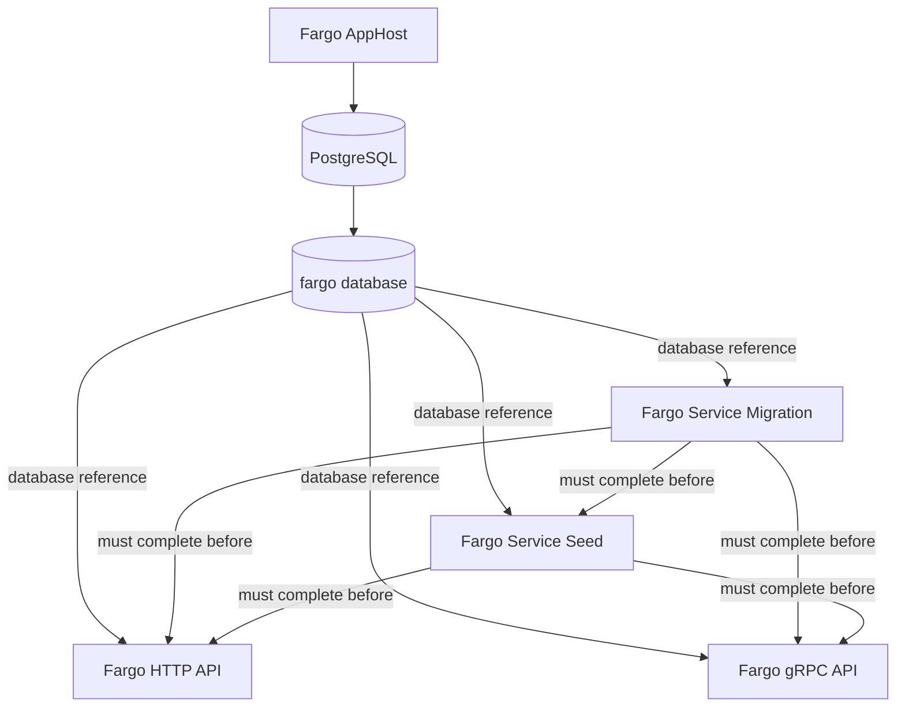

# Architecture

## Application Startup

Fargo uses .NET Aspire to orchestrate its application services and infrastructure.

The startup order is:

```mermaid
flowchart TD
    AppHost["Fargo AppHost"]

    PostgreSQL[("PostgreSQL")]
    FargoDB[("fargo database")]

    Migration["Fargo Service Migration"]
    Seed["Fargo Service Seed"]
    HTTP["Fargo HTTP API"]
    GRPC["Fargo gRPC API"]

    AppHost --> PostgreSQL
    PostgreSQL --> FargoDB

    FargoDB -->|database reference| Migration
    FargoDB -->|database reference| Seed
    FargoDB -->|database reference| HTTP
    FargoDB -->|database reference| GRPC

    Migration -->|must complete before| Seed
    Migration -->|must complete before| HTTP
    Migration -->|must complete before| GRPC

    Seed -->|must complete before| HTTP
    Seed -->|must complete before| GRPC
```
